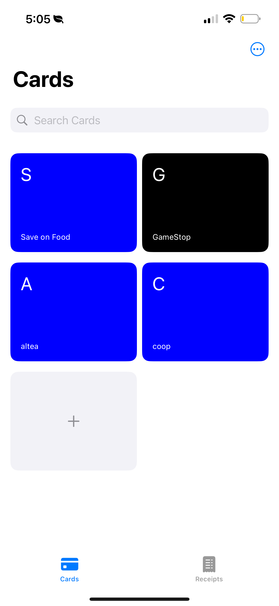
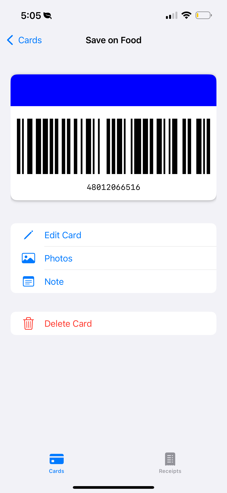
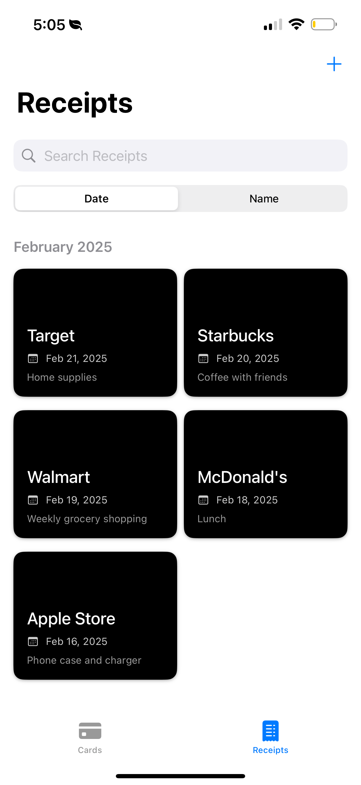

# Easy Card

Easy Card is a user-friendly membership card management application that helps users digitally manage various membership cards, loyalty cards, and discount cards.

## Key Features

- 📱 Digital Card Management
- 🔍 Barcode Scanning and Generation
- 📝 Card Notes Function
- 📸 Receipt/Photo Management
- 🎨 Custom Card Colors and Styles
- 🔄 Real-time Data Synchronization

## 💡 Usage Tips

For the best user experience, we strongly recommend:
1. Add the Easy Card Widget to the left side of your home screen
2. When you need to show your membership card at a store, simply swipe right from the lock screen
3. Quickly view and open the barcode for store staff to scan
4. Say goodbye to unlocking your phone, finding the app, and searching for membership cards!

## App Screenshots

    
    
    
    

## Technical Features

- Modern UI built with SwiftUI
- Barcode processing using Core Image
- Photo management with PhotosUI
- Local data persistence support

## Main Views

- `CardListView`: Card list display
- `CardDetailView`: Card detail information
- `EditCardView`: Card editing interface
- `PhotosView`: Photo management
- `ReceiptsView`: Receipt management
- `BarcodeScannerView`: Barcode scanning
- `NoteEditView`: Note editing interface

## System Requirements

- iOS 15.0 or later
- Xcode 14.0 or later

## Installation Guide

1. Clone the repository
2. Open project in Xcode
3. Select target device or simulator
4. Click run button to build and launch the app

## Privacy Notice

The app requires the following permissions:
- Camera access (for barcode scanning)
- Photo library access (for saving and managing photos)

## Contributing

Issues and Pull Requests are welcome to help improve this project.

## License

MIT License

Copyright (c) 2024 [Haifeng Zhang]

Permission is hereby granted, free of charge, to any person obtaining a copy
of this software and associated documentation files (the "Software"), to deal
in the Software without restriction, including without limitation the rights
to use, copy, modify, merge, publish, distribute, sublicense, and/or sell
copies of the Software, and to permit persons to whom the Software is
furnished to do so, subject to the following conditions:

The above copyright notice and this permission notice shall be included in all
copies or substantial portions of the Software.

THE SOFTWARE IS PROVIDED "AS IS", WITHOUT WARRANTY OF ANY KIND, EXPRESS OR
IMPLIED, INCLUDING BUT NOT LIMITED TO THE WARRANTIES OF MERCHANTABILITY,
FITNESS FOR A PARTICULAR PURPOSE AND NONINFRINGEMENT. IN NO EVENT SHALL THE
AUTHORS OR COPYRIGHT HOLDERS BE LIABLE FOR ANY CLAIM, DAMAGES OR OTHER
LIABILITY, WHETHER IN AN ACTION OF CONTRACT, TORT OR OTHERWISE, ARISING FROM,
OUT OF OR IN CONNECTION WITH THE SOFTWARE OR THE USE OR OTHER DEALINGS IN THE
SOFTWARE. 